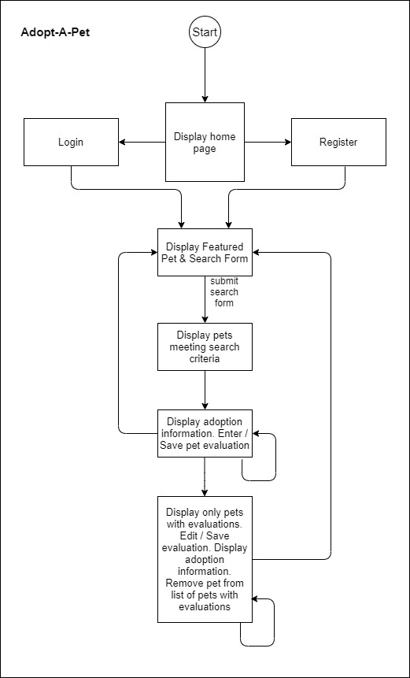

# Springboard Capstone 1 Project

## Project Name: Adopt A Pet

## Developer: Philip Bailey

## Introduction

This project is a milestone in Springboards Software Engineering Bootcamp. The project is started at about 40-45% completion of the bootcamp and is designed for the developer to pull together and use concepts exposed in the bootcamp up to the project assignment.

## Description

The Adopt A Pet website allows users to search for potential pets and create and store evaluations of any pet to assist in determining the pet for adoption. The user enters search criteria (species, gender, zip code search origin, and search distance from origin) and animals meeting those criteria are displayed to the user. Each pet displayed can be evaluated for suitability and that evaluation stored, retrieved later, and used to compare animals so that an adoption decision can be made.

## Locations

### GitHub Repository: <https://github.com/ursawd/adopt-a-pet>

### Heroku Deployment: <https://adopt-a-pet-selector.herokuapp.com/>

## Project Features

The Adopt A Pet project is designed about a Python backend accessing an external API for retrieving information about adoptable pets in the Petfinder system of animal shelters. Pet reference and evaluation information is stored in PostgreSQL data and retrieved for side-by-side display of animals with evaluations so that comparisons can be made about adoption suitability. JavaScript controls the evaluation creation, editing, storing. Access control is accomplished using the bcrypt password-hashing function. Layout and styling are accomplished using Bootstrap. Unittest tests were created for the models and routes. A flask custom decorator was created to enforce route authorization.

## Tech Stack

Python JavaScript HTML CSS GIT Heroku Unittest Flask SQLAlchemy WTForms Jinja2 Axios PostgreSQL dotend vscode

## API

### Petfinder API

[https://www.petfinder.com/developers/v2/docs/](https://www.petfinder.com/developers/v2/docs/)

### Concept

The Petfinder API (Application Programming Interface) allows you to access the Petfinder database of hundreds of thousands of pets ready for adoption and over ten thousand animal welfare organizations. You can use the API to build your own dynamic websites or applications backed by the same data used on Petfinder.com.

### Capabilities

With the Petfinder API, you can:

- Search for and display pet listings based on pet characteristics, location, and status.
- Search for and display animal welfare organizations based on organization name, ID, and location.

You can, for example, display a random selection of available pets on a webpage; set up pages to display pets in various categories; allow visitors to your site to search for adoptable pets based on a number of criteria; or display profiles of local organizations.

### Using the API

This is a RESTful API, meaning that it uses predictable URLs to access resources and, in case of an error, returns meaningful HTTP response codes. This enables the use of GET, POST, and HTTP authentication, which standard HTTP clients understand. The API supports cross-origin resource sharing, which allows you to use it securely from a client-side web application. You use the API by sending requests with a specific structure to our servers. In order to maintain security, it uses access tokens for API requests.

#### Getting Authenticated

The Petfinder API uses OAuth for secure authentication.

In order to begin, you need:

- A Petfinder account; if you do not have one, create an account.
- A Petfinder API Key (otherwise called Client ID) and Secret. (Visit www.petfinder.com/developers to request one.)
- A way of sending requests to our server along with information that will tell it you are allowed to do so. We recommend cURL for testing.

## User Flow

